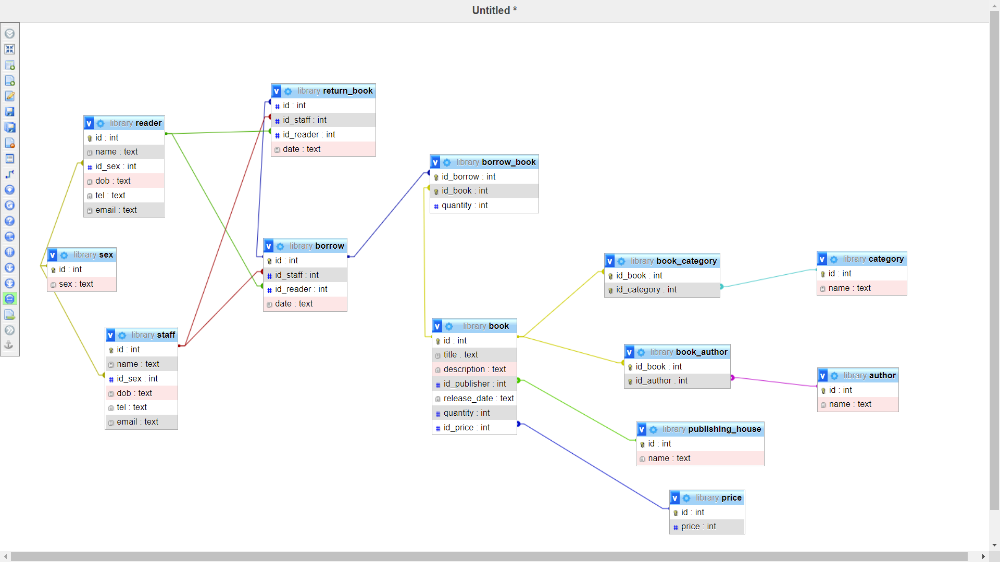

## Create database
```roomsql
create database library
```

### Create category table

```roomsql
create table category(
	id int primary key not null AUTO_INCREMENT,
    name text
)
```

### Create publishing_house table

```roomsql
create table publishing_house(
	id int primary key not null AUTO_INCREMENT,
    name text
)
```

### Create price table

```roomsql
create table price(
	id int primary key not null auto_increment,
    price int
)
```

### Create book table

```roomsql
 create table book(
	id int primary key not null auto_increment,
    title text,
    description text, 
    id_publisher int,
    foreign key (id_publisher) references publishing_house(id),
    release_date text,
    quantity int,
    id_price int
    foreign key (id_price) references price(id)
)
```

### Create book_category table
```roomsql
create table book_category(
	id_book int,
    id_category int,
    primary key(id_book,id_category),
    foreign key (id_book) references book(id),
    foreign key (id_category) references category(id)
)
```

### create author table

```roomsql
create table author(
	id int primary key not null auto_increment,
    name text
)
```

### create book_author table

```roomsql
create table book_author(
	id_book int,
    id_author int,
    primary key(id_book,id_author),
    foreign key (id_book) references book(id),
    foreign key (id_author) references author(id)
)
```

### create sex table

```roomsql
create table sex(
	id int primary key not null,
    sex text
)
```

### create staff table
```roomsql
create table staff(
	id int primary key not null auto_increment,
    name text,
    id_sex int,
    foreign key (id_sex) references sex(id),
    dob text,
    tel text,
    email text
)
```

### create reader table
```roomsql
create table staff(
	id int primary key not null auto_increment,
    name text,
    id_sex int,
    foreign key (id_sex) references sex(id),
    dob text,
    tel text,
    email text
)
```

### create borrow table
```roomsql
create table borrow(
    id int primary key not null auto_increment,
    id_staff int,
    id_reader int,
    foreign key (id_staff) references staff(id),
    foreign key (id_reader) references reader(id),
    date text
)
```

### create borrow_book table

```roomsql
create table borrow_book(
    id_borrow int,
    id_book int,
    primary key(id_borrow, id_book),
    foreign key(id_borrow) references borrow(id),
    foreign key (id_book) references book(id),
    quantity int not null
)
```

### create return table

```roomsql
create table return_book(
	id int,
    foreign key (id) REFERENCES borrow(id),
    id_staff int,
    id_reader int,
    foreign key (id_staff) references staff(id),
    foreign key (id_reader) references reader(id),
    date text
)
```

### IMG
